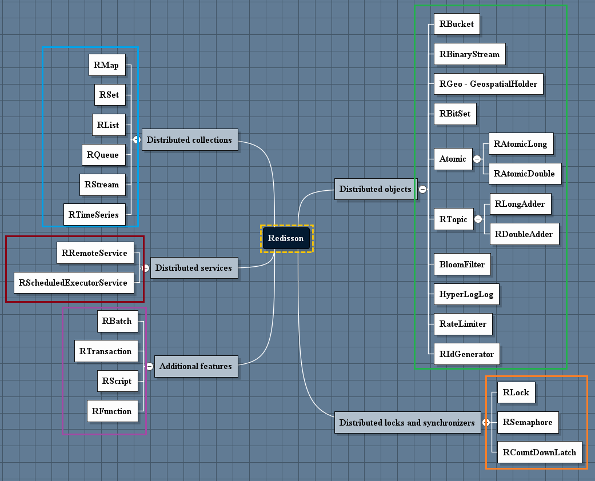

# notes

強一致性：寫操作完成之後，讀操作一定能讀到最新資料。通俗地講就是客戶端只要把結果寫進去了，什麼時候訪問都能拿到最新的資料。但是在分散式場景中很難實現

弱一致性：不保證拿到最新的資料，也有可能拿到舊的資料。

real web developer

https://ithelp.ithome.com.tw/users/20103854/ironman/5413

---

https://aws.amazon.com/tw/redis/

https://aws.amazon.com/tw/elasticache/redis/

https://aws.amazon.com/tw/memorydb/

華為雲

https://support.huaweicloud.com/intl/en-us/productdesc-dcs/CacheCluster.html

---

原來 Redisson 核心作者是大陸人

顾睿：Redisson 核心作者（Jack Gu）

阿里云专访Redisson作者Rui Gu：构建开源企业级Redis客户端之路

https://developer.aliyun.com/article/603575

-----
学习 Redis 你应该知道的几个名人

antirez：Redis 和 Redis-sentinel 的作者（Salvatore Sanfilippo）、《Redis 宣言（Redis Manifesto）》作者

付磊：《Redis开发与运维》作者（联合作者 张益军）、《阿里云Redis的开发规范》作者

老钱：（钱文品）《Redis 深度历险：核心原理与应用实践》作者

xetorthio：Jedis 作者（Jonathan Leibiusky）

王乃峥、黄东旭：Codis 作者

Salvatore Sanfilippo：Redis Labs CTO

https://zhuanlan.zhihu.com/p/66729522

---

電子書

https://github.com/7-sevens/Developer-Books/tree/master/Redis

---

redis 補充資料

http://dsagitlab.neutec.com.tw/stan.huang/redis_client_example/

http://dsagitlab.neutec.com.tw/stan.huang/redis_client_example/-/blob/master/README.md

---

https://redisson.org/articles/the-top-5-redis-based-objects-used-in-java.html

目前我已經有試過 "Distributed objects"，接下來會試看看 Distributed collections 分布式集合。

https://github.com/redisson/redisson/wiki/6.-distributed-objects

---

根據 Redisson 官方文件整理出來的心智圖，給大家參考。

---

參考這份投影片 Redis concept and annotation

https://newnas.neutec.com.tw:5001/d/f/lpJ2gXUw1uZsefaYe3byxjOAIeX8WxiQ

---

原來 redis 的讀取標準應該從 0.1 ms 起跳，0.1 ms ~ 1 ms

stan: slowlog 標準我設定1.5ms

Latency Numbers Programmer Should Know

https://www.youtube.com/watch?v=FqR5vESuKe0

https://twitter.com/sahnlam/status/1577894459408547840?s=46&t=wX4w8iWB_VuFX3JSAVT39A

---

分享 Redis 官方提供的 Redis GUI

https://redis.com/redis-enterprise/redis-insight/

---

4 個 redis 火力展示 開源專案

1. 排行榜
2. real-time 即時庫存系統
3. real-time 零售 Banking 金流系統
4. Priority Quent Client

https://launchpad.redis.com/project/basic-redis-leaderboard-demo-java

https://launchpad.redis.com/project/brewdis

https://launchpad.redis.com/project/redisbank

https://launchpad.redis.com/project/RedisPQClient

---

千萬級 用戶 排行榜

https://developer.aliyun.com/article/312562

redis 排行榜

https://segmentfault.com/a/1190000018636887

---

CountDownLatch 倒數計時鎖

當在執行多執行的程式時，如果有一個執行緒需要等待其它執行緒都執行結束，再繼續使用。

則可以考慮使用 java.util.concurrent package 下的 CountDownLatch 類別。

Redisson 提供了分散式的實作類別 RCountDownLatch ，並且可以設定 多久之後要 timeout

---

Redis HyperLogLog -> 統計

https://iter01.com/678217.html

---

Redis Pub/Sub 是什麼、會造成什麼問題呢?

https://medium.com/jerrynotes/redis-pub-sub-%E6%98%AF%E4%BB%80%E9%BA%BC-%E6%9C%83%E9%80%A0%E6%88%90%E4%BB%80%E9%BA%BC%E5%95%8F%E9%A1%8C%E5%91%A2-ab5be1e5328d

---

分享一下，redisson 有提供 RAtomicLong。

如上面圖片顯示，java 的 AtomicLong 在分散式環境下，可能不會是 atomic 的。建議改用 RAtomicLong。

---

在分散式系統中，其中一個最重要的概念就是「一致性」(Consistency)。

一致性： 每一個節點儲存相同且順序一致的資料，同時保證使用者的每次讀取操作皆返回最新的資訊。

而如何讓分散式集群中的每一個節點
- 1 儲存相同的數據
- 2 並且對某一個提案 (proposal) 達成一致認同並保存

便是分散式系統中一個重要的重要問題，而「共識演算法」便是用來達成「一致性」的方法。

https://ithelp.ithome.com.tw/m/articles/10219813

---

不知道大家有沒有處理過，怎麼讓一個需要定期執行的 job，讓多台 server 可以輪流做。

比較常見的作法有用 lock，不管是 db lock 或 redis lock。這邊分享其實還有一種作法，是投票選領袖的方式。

上面這個網址已經是我找到說明比較簡單的文章。如果要更生活化的例子，大家可以想像猜拳或是出數字比大小，猜贏的 server 就是選出的領袖，有權利執行 job。 😏

---

https://redis.io/docs/data-types/lists/

https://redis.com/ebook/part-1-getting-started/chapter-1-getting-to-know-redis/1-2-what-redis-data-structures-look-like/1-2-2-lists-in-redis/

redis中List类型底层存储结构分析

https://chibiao.gitee.io/myblog/2020/07/12/Redis%E4%B8%ADList%E5%BA%95%E5%B1%82%E5%AD%98%E5%82%A8%E7%BB%93%E6%9E%84%E5%88%86%E6%9E%90/

---

Redis 官方課程與認證

https://university.redis.com/#courses

https://university.redis.com/certification/

https://redis.com/blog/redis-developer-certification-is-here/

---

分享一下 關於 redisson，上面兩張圖是在說，如果不是付費用 Pro 版，那 redisson 的 Map 跟 Set 是不會有 data partition 的功能，

也就是你放進 map 的東西，只會集中在某一個 master node 上，而不會分散放在 redis cluster 中的其他 master nodes。

除了佔用記憶體，網路存取也會集中在那一台 master node。

---

不要用 integer 做 hashmap key

https://cloud.tencent.com/developer/article/1421984

private EnumMap<EnumMapTestEnum, String> enumMapTest;

但是如果使用 EnumMap , 應該就可以正常轉型

https://github.com/redisson/redisson/issues/1293

---

ACID 就是在 database 上面處理 transaction 要注意的事項

https://lance.coderbridge.io/2021/04/24/short-what-is-acid/

---

sentinel

https://ithelp.ithome.com.tw/articles/10285604

---

Redis 學習筆記(5)-客戶端整合 Redis

https://ithelp.ithome.com.tw/articles/10285557

---

redisson实现分布式锁存在的问题

在 redis cluster 模式下，如果创建key成功、获取到锁，但在尚未同步到任何一个slave时master宕机，选举一个slave作为master，此时新master上不存在对应的key，其它线程依然可以创建key成功、获取到锁，可能存在多个线程获取到同一把锁的情况。

————————————————
版权声明：本文为CSDN博主「chy1984」的原创文章，遵循CC 4.0 BY-SA版权协议，转载请附上原文出处链接及本声明。
原文链接：https://blog.csdn.net/chy_18883701161/article/details/106380296

---

Kafka vs Redis Stream

https://www.memurai.com/blog/apache-kafka-vs-redis-streams

https://mattwestcott.org/blog/redis-streams-vs-kafka

https://www.instaclustr.com/blog/redis-streams-vs-apache-kafka/

---

