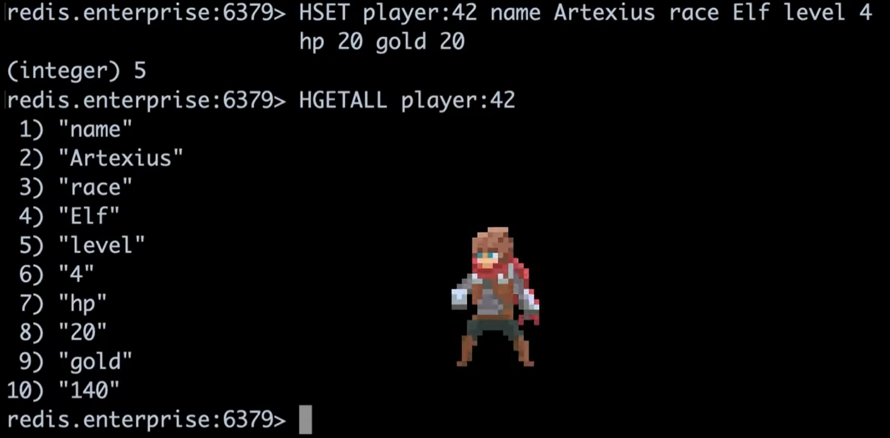
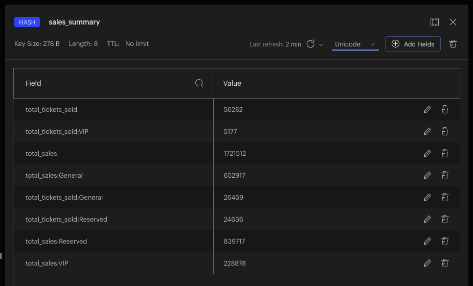

# ppt redis 01

# Redis & Redisson

- chart

# introduction

我們將詳細討論 這些 主題,
- 可以執行的命令
- 性能影響

"知道資料結構可以做什麼"，是了解 Redis 的重要關鍵。

但要成功使用 Redis，讓我們能真正享受它的優點跟好處，

重點也在於，

對於特定的領域問題及使用情境，

我們在何時該使用，又應該如何來使用這些資料結構

在 Redis 大學中，結合了這些資料結構，用來解決一個具替問題，如何用 Redis 為 2020 東京奧運建立預約訂票系統。

我們會看到怎麼做
- 庫存控制，
- 狀態管理，
- 座位預訂，
- 通知
- 以及 Redis 的其他使用情境。

## important concepts

- keys
  - naming
    - sales_summary
    - sales_summary:Football
    - .
    - user:{userSeqId} -> user:1000 -> 存 user 的資料
    - user:{userSeqId}:followers -> user:1000:followers -> 存 user 號碼 1000 的 followers
    - .
    - set inventory:100-meters-womens-final 1000
    - set inventory:4x100m-womens-final 1000
    - .
    - player:1000:credit-balance 
    - player:1000.wallet -> 100
    - player:1000.wallet -> empty
    - .
  - 好的命名規範，才能避免以後衝突
  - .
  - 無論您選擇什麼，重要的是您在整個團隊和項目中使用一致的 命名約定 命名規範。
  - .
    當多個團隊、專案 或 微服務 都使用同一組 Redis 服務 時，這一點變得 非常重要。
  - .
    我們希望避免 跨專案，跨團隊、使用情境 和 領域 的任何 鍵值名稱 衝突。
  - .
- .

- db seq id -> uuid
- .

- 資料大小
  - key: 512MB
  - value: 512MB
  - 不代表 真的可以放 512MB
  - 要考慮 資料傳輸 / 資料儲存，以及所選擇的 redis data type
  - .
- .

## use cases

- Strings
  - can be numbers or plain text
  - 小數以下 17 位
  - 
  - .
- Hash -> Java HashMap
  - model a user from a SQL table
  - 可以動態 add / remove field
  - .
  - summary data
    - HINCRBY sales_summary total_sales 1
    - HINCRBY sales_summary total_sales -1
    - HMSET sales_summary total_sales 1721512 total_tickets_sold 56282
    - .
  - ticket availability
    - HSET event:judo availability:gold 7990
    - HSET event:judo availability:silver 2000
    - 旅行社 機票
    - 台鐵 搶票
    - .
  - Rate Limiting
    - hmset ep-20180210
      - "/pet/{petId}" 100
      - "/booking/{petId}" 100
  - .

- Lists -> Queues
  - LRANGE 0 9 以獲取最新發布的 10 筆資訊
  - 另一個例子是社交新聞系統
  - Another example is social news feed system: FB, Slack, Twitter, etc.
  - .
  - 可以插入中間任何位置
  - .
  - Sportfy playlist
    - .
  - Order list
    - 訂單
    - LPUSH orders:4x100-womens-final jane:4 bill:8 charlie:6
    - 候補名單
    - LPUSH waitlist:basketball-mens-final brain:2
    - .
  - .
- Sets
  - SINTER tag:Java:posts tag:MySQL:posts tag:Redis:posts
  - 搜索過濾器
  - search filter
  - .
- Sorted Sets
  - Stack Overflow rank the highest voted answers for each proposed question
  - Stack Overflow 為每個提議的問題排名最高的投票答案
  - leaderboard
  - 排行榜
  - .

- Strings
  - customer:1500 -> jane
  - .
- .
- Streams -> collecting data
  - .
- Pub/Sub -> messaging
  - .
- .

